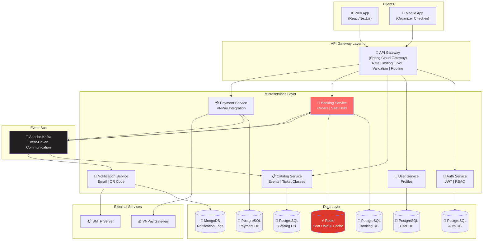
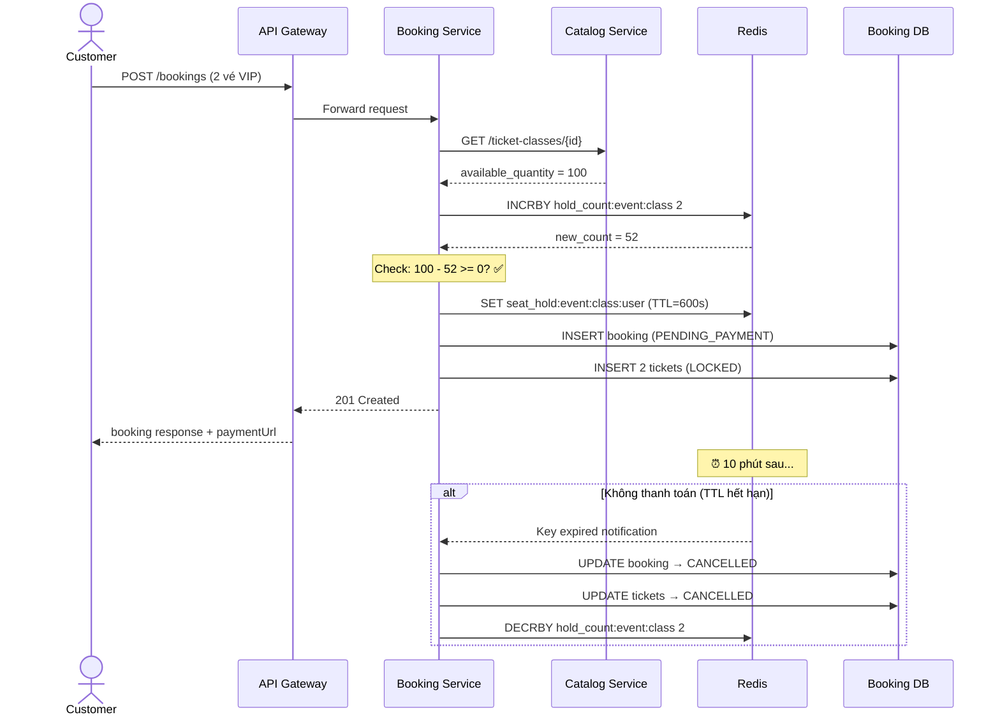
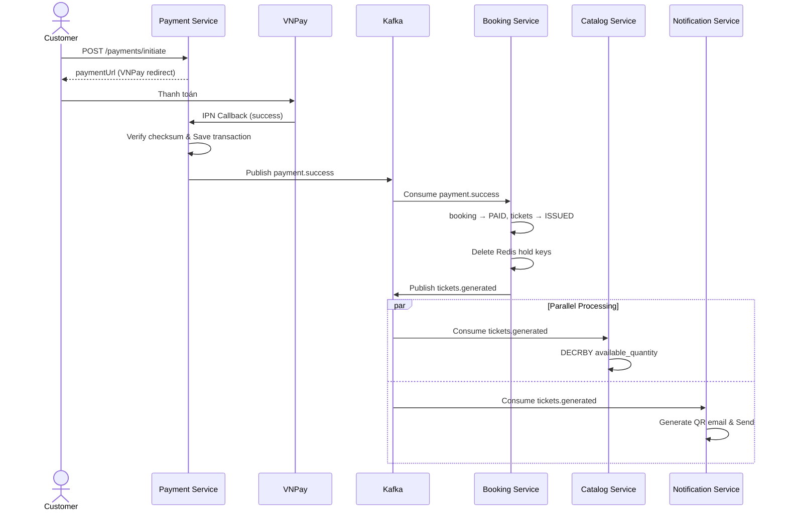
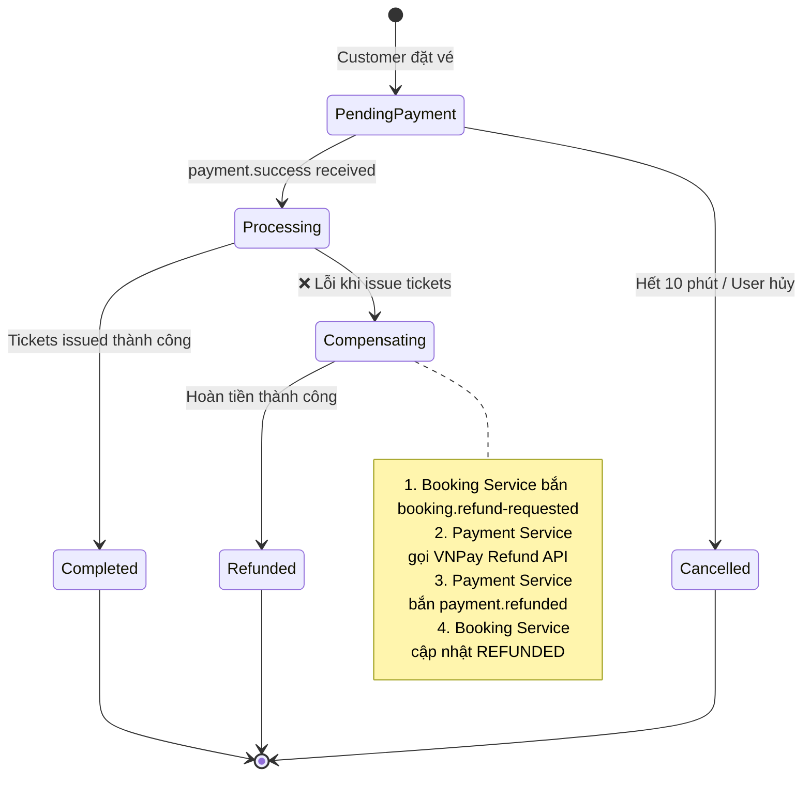
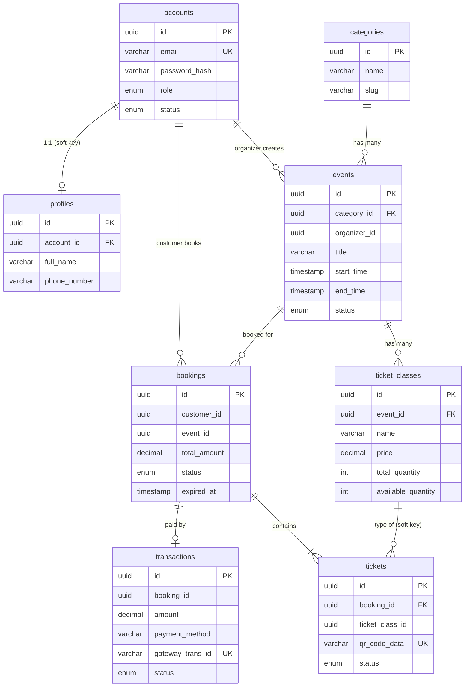
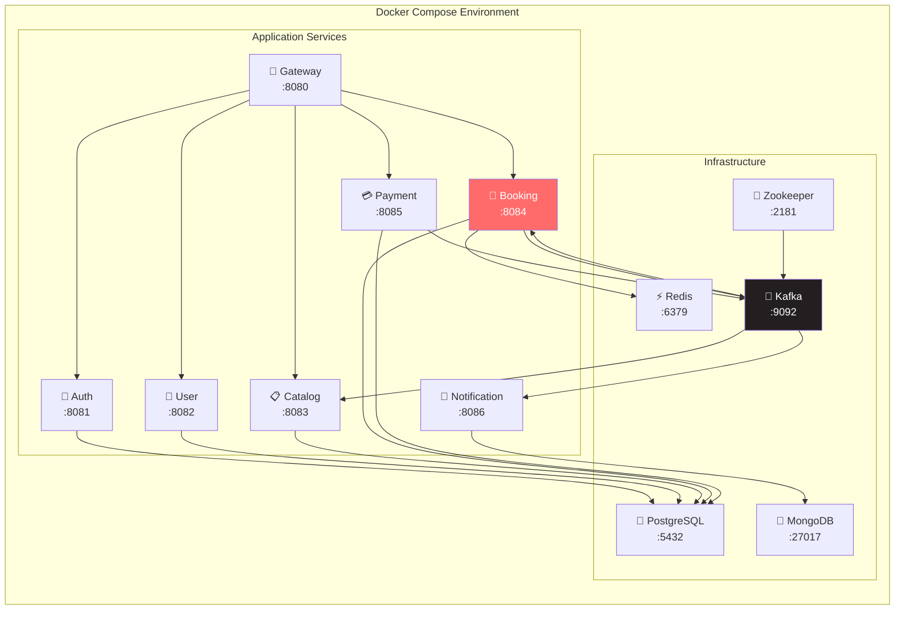
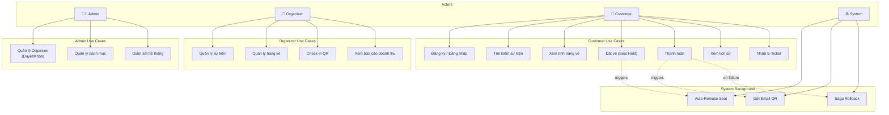

# 📊 Architecture Diagrams — TicketBooking

> Sơ đồ kiến trúc hệ thống sử dụng Mermaid

---

## 1. System Architecture Overview

---

## 2. Seat Hold Flow (Chống Overbooking)

---

## 3. Payment & Event-Driven Flow

---

## 4. Saga Compensation Flow (Hoàn tiền)

---

## 5. Database Relationships (ER Diagram)

---

## 6. Deployment Architecture (Docker Compose)

---

## 7. Use Case Diagram

---

> 📄 Xem thêm: [System Design](system-design.md) | [Database Schema](database-schema.md) | [API Design](api-design.md) | [Technical Flows](technical-flows.md)
