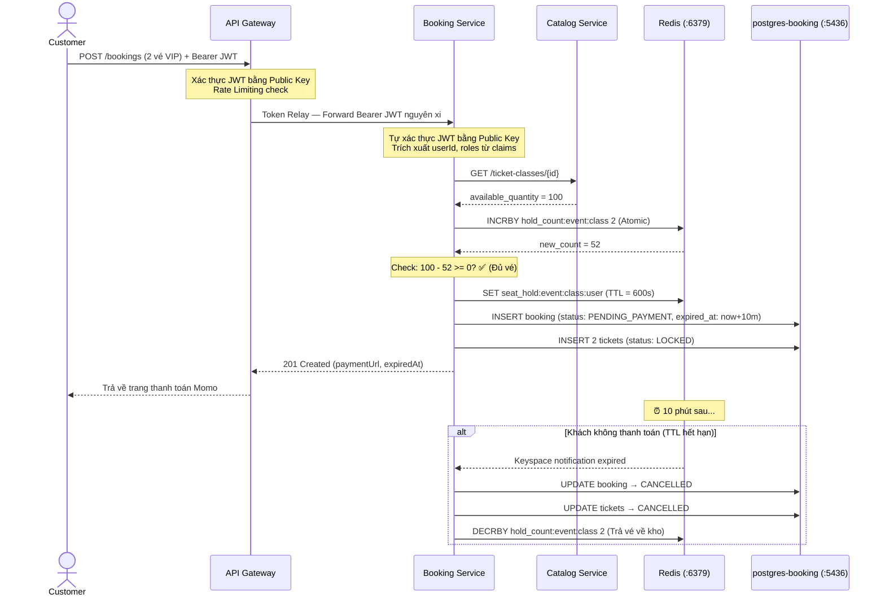
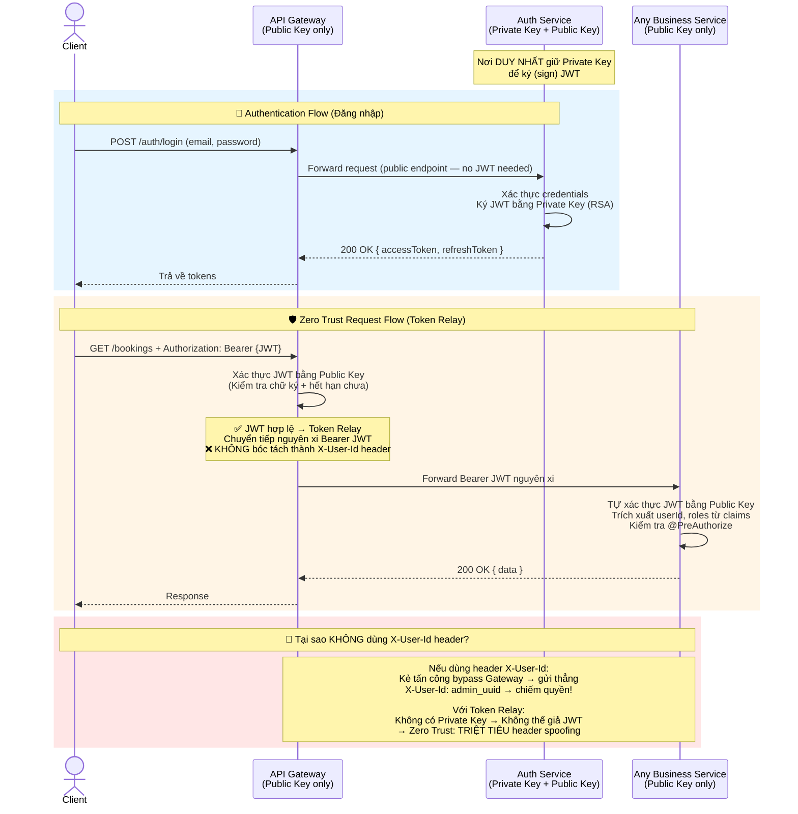
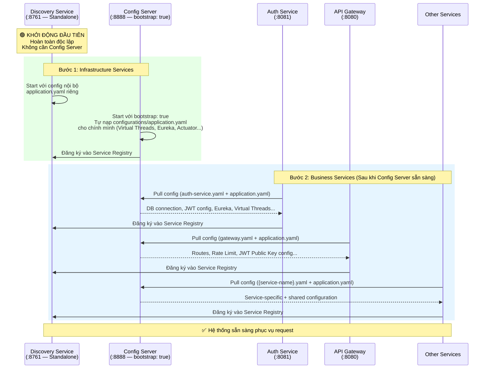
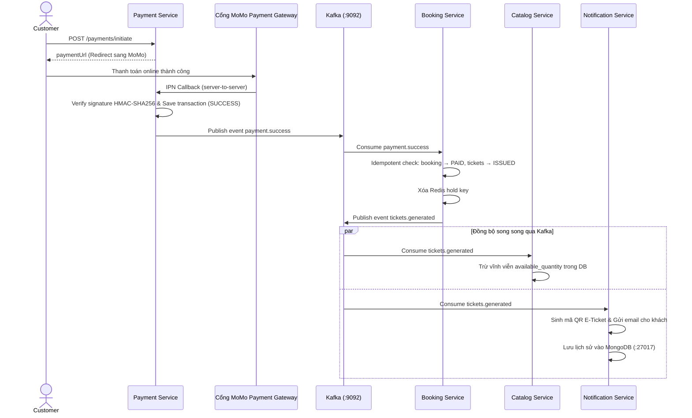
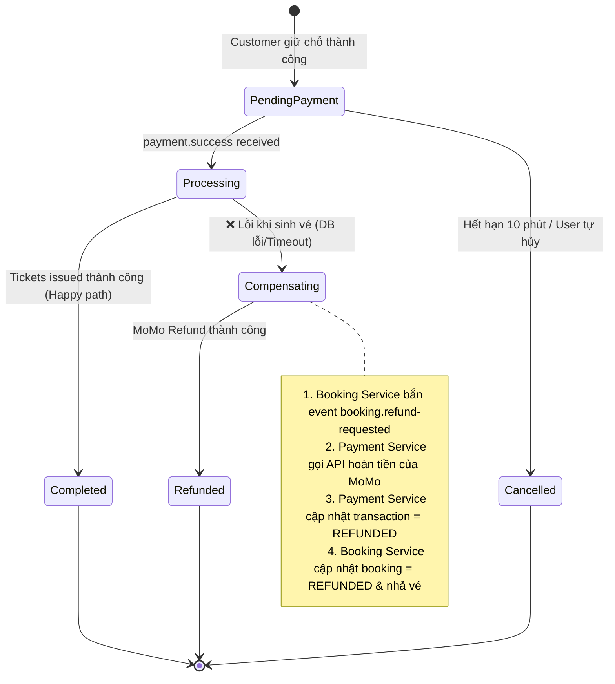
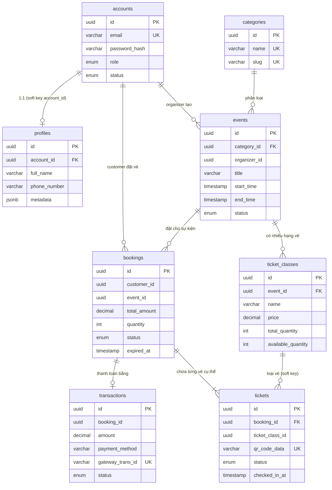
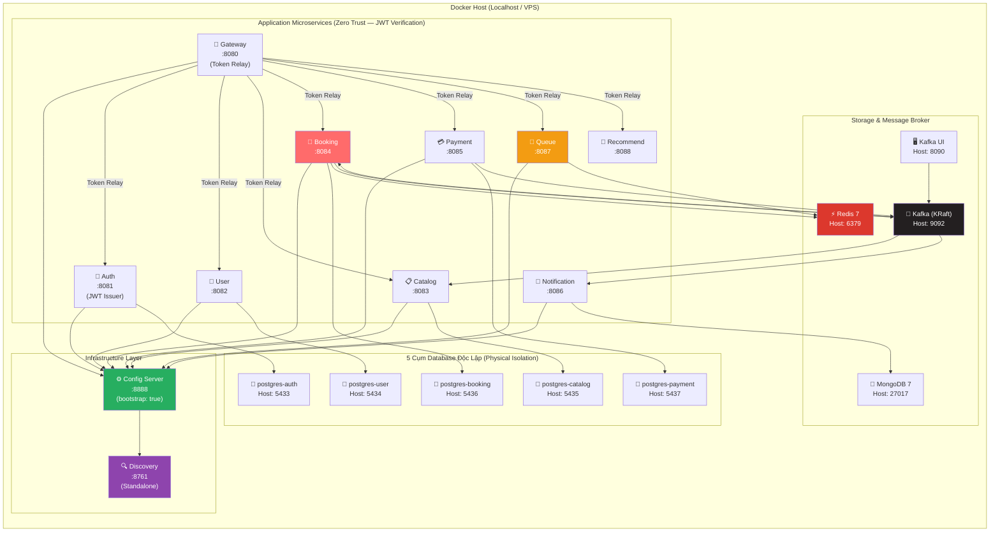

# 📊 Architecture Diagrams — TicketBooking

> Sơ đồ kiến trúc hệ thống sử dụng Mermaid

---

## 1. System Architecture Overview (Chuẩn Enterprise)

```mermaid
flowchart TD
    subgraph Clients["Client Layer"]
        WEB["🌐 Web App<br/>(React / Next.js)"]
        MOB["📱 Mobile App<br/>(Flutter / React Native)"]
    end

    subgraph Edge["Edge / Reverse Proxy Layer"]
        CF["☁️ Reverse Proxy<br/>(Cloudflare / Nginx)<br/>DDoS Protection | SSL Termination | Caching"]
    end

    subgraph GatewayLayer["API Gateway Layer — Zero Trust Token Relay"]
        GW["🚪 API Gateway<br/>(Spring Cloud Gateway - Spring Boot 4.1.1+)<br/>JWT Validation (Public Key) | Rate Limiting | Token Relay"]
    end

    subgraph InfraServices["Infrastructure Support Services"]
        CONFIG["⚙️ Config Server<br/>(Spring Cloud Config - :8888)<br/>Centralized Configuration<br/>bootstrap: true (tự nạp cấu hình chung)"]
        EUREKA["🔍 Discovery Service<br/>(Spring Cloud Eureka - :8761)<br/>Service Registry & Health<br/>(Standalone — Không phụ thuộc Config Server)"]
        OBS["📈 Observability & Tracing<br/>(Prometheus / Grafana / Jaeger)<br/>Metrics & Distributed Tracing"]
    end

    subgraph BusinessServices["Business Microservices Layer (Java 21+ / Spring Boot 4.1.1+)<br/>Mỗi service tự xác thực JWT bằng Public Key (Zero Trust)"]
        AUTH["🔐 Auth Service (:8081)<br/>JWT Issuer (Private Key)<br/>RBAC & Token Management"]
        USER["👤 User Service (:8082)<br/>Profiles & KYC"]
        CATALOG["📋 Catalog Service (:8083)<br/>Events & Ticket Classes"]
        BOOKING["🎫 Booking Service (:8084)<br/>Core Order & Seat Holding"]
        PAYMENT["💳 Payment Service (:8085)<br/>MoMo Payment Gateway"]
        QUEUE["🚦 Queue Service (:8087)<br/>Virtual Waiting Room (WebSocket)"]
        NOTIF["📧 Notification Service (:8086)<br/>Email & QR Code Generation"]
        RECOMMEND["🤖 Recommend Service (:8088)<br/>(Python / FastAPI)<br/>AI Event Recommendation"]
    end

    subgraph DataLayer["Data Layer (Physical Isolation — Database per Service)"]
        PG_AUTH[("🐘 postgres-auth<br/>:5433")]
        PG_USER[("🐘 postgres-user<br/>:5434")]
        PG_CATALOG[("🐘 postgres-catalog<br/>:5435")]
        PG_BOOKING[("🐘 postgres-booking<br/>:5436")]
        PG_PAYMENT[("🐘 postgres-payment<br/>:5437")]
        REDIS[("⚡ Redis<br/>:6379<br/>Lock & Queue")]
        MONGO[("🍃 MongoDB<br/>:27017<br/>Notification Logs")]
    end

    subgraph Messaging["Event-Driven Backbone"]
        KAFKA["📨 Apache Kafka<br/>(KRaft Mode - :9092)<br/>Event-Driven Architecture"]
        KAFKA_UI["🖥️ Kafka UI<br/>(:8090)"]
    end

    subgraph External["External Services"]
        VNPAY["💰 MoMo Gateway"]
        SMTP["📬 SMTP Mail Server"]
    end

    WEB --> CF
    MOB --> CF
    CF --> GW

    %% Gateway forwards Bearer JWT (Token Relay) to all business services
    GW -- "Bearer JWT<br/>(Token Relay)" --> AUTH
    GW -- "Bearer JWT<br/>(Token Relay)" --> USER
    GW -- "Bearer JWT<br/>(Token Relay)" --> CATALOG
    GW -- "Bearer JWT<br/>(Token Relay)" --> BOOKING
    GW -- "Bearer JWT<br/>(Token Relay)" --> PAYMENT
    GW -- "Bearer JWT<br/>(Token Relay)" --> QUEUE
    GW -- "Bearer JWT<br/>(Token Relay)" --> RECOMMEND

    %% Config-First: Business services pull config from Config Server at startup
    AUTH -- "Pull Config<br/>(bootstrap)" --> CONFIG
    USER -- "Pull Config<br/>(bootstrap)" --> CONFIG
    CATALOG -- "Pull Config<br/>(bootstrap)" --> CONFIG
    BOOKING -- "Pull Config<br/>(bootstrap)" --> CONFIG
    PAYMENT -- "Pull Config<br/>(bootstrap)" --> CONFIG
    QUEUE -- "Pull Config<br/>(bootstrap)" --> CONFIG
    NOTIF -- "Pull Config<br/>(bootstrap)" --> CONFIG
    GW -- "Pull Config<br/>(bootstrap)" --> CONFIG

    %% All services register with Eureka
    GW --> EUREKA
    AUTH --> EUREKA
    USER --> EUREKA
    CATALOG --> EUREKA
    BOOKING --> EUREKA
    PAYMENT --> EUREKA
    QUEUE --> EUREKA
    NOTIF --> EUREKA
    CONFIG --> EUREKA

    %% Data connections
    AUTH --> PG_AUTH
    USER --> PG_USER
    CATALOG --> PG_CATALOG
    BOOKING --> PG_BOOKING
    BOOKING --> REDIS
    PAYMENT --> PG_PAYMENT
    QUEUE --> REDIS
    NOTIF --> MONGO

    %% Kafka event-driven
    PAYMENT --> KAFKA
    BOOKING --> KAFKA
    KAFKA --> BOOKING
    KAFKA --> CATALOG
    KAFKA --> NOTIF
    KAFKA_UI --> KAFKA

    %% External integrations
    PAYMENT --> MOMO
    NOTIF --> SMTP

    OBS -.- GW & AUTH & BOOKING & PAYMENT & KAFKA

    style BOOKING fill:#ff6b6b,color:#fff
    style QUEUE fill:#f39c12,color:#fff
    style KAFKA fill:#231f20,color:#fff
    style REDIS fill:#dc382d,color:#fff
    style RECOMMEND fill:#3498db,color:#fff
    style CONFIG fill:#27ae60,color:#fff
    style EUREKA fill:#8e44ad,color:#fff
```

---

## 2. Seat Hold Flow (Chống Overbooking với Redis Atomic)

---

## 3. Zero Trust Security Flow (Token Relay & Asymmetric Keys)

---

## 4. Config-First Boot Sequence (Thứ Tự Khởi Động Hệ Thống)

---

## 5. Payment & Event-Driven Flow (Kafka Choreography)

---

## 6. Saga Compensation Flow (Hoàn tiền khi lỗi hệ thống)

---

## 7. Database Relationships (ER Diagram)

---

## 8. Deployment Architecture (Docker Compose — 5 Postgres Độc Lập)

---

## 9. Use Case Diagram Tổng Quan

```mermaid
flowchart TD
    subgraph Actors["Tác Nhân (Actors)"]
        ADMIN["👨‍💼 Admin"]
        ORG["🏢 Organizer"]
        CUST["👤 Customer"]
        SYS["⚙️ System Background"]
    end

    subgraph UC_Admin["Admin Use Cases"]
        A1["Duyệt/Khóa Organizer"]
        A2["Quản lý danh mục sự kiện"]
        A3["Giám sát hệ thống (Dashboard)"]
    end

    subgraph UC_Org["Organizer Use Cases"]
        O1["Đăng tải & Publish sự kiện"]
        O2["Cấu hình hạng vé (VVIP, VIP, GA)"]
        O3["Quét mã QR Check-in cổng"]
        O4["Xem báo cáo doanh thu & lấp đầy"]
    end

    subgraph UC_Cust["Customer Use Cases"]
        C1["Đăng ký / Đăng nhập JWT"]
        C2["Tìm kiếm & Lọc sự kiện"]
        C3["Nhận gợi ý sự kiện (AI Recommend)"]
        C4["Xếp hàng phòng chờ ảo (Queue)"]
        C5["Giữ chỗ tạm thời (Seat Hold 10m)"]
        C6["Thanh toán VNPay Sandbox"]
        C7["Nhận vé E-Ticket qua email"]
    end

    subgraph UC_Sys["System Use Cases"]
        S1["Tự động nhả vé khi quá 10 phút"]
        S2["Tự động kick khỏi queue khi mất mạng (15s)"]
        S3["Gửi email vé điện tử tự động (Kafka)"]
        S4["Saga Rollback: Tự động hoàn tiền khi lỗi"]
    end

    ADMIN --> A1 & A2 & A3
    ORG --> O1 & O2 & O3 & O4
    CUST --> C1 & C2 & C3 & C4 & C5 & C6 & C7
    SYS --> S1 & S2 & S3 & S4

    C5 -.-|"trigger"| S1
    C4 -.-|"trigger"| S2
    C6 -.-|"trigger"| S3
    C6 -.-|"on failure"| S4
```

---

> 📄 Xem tiếp:
> * [Thiết kế hệ thống tổng quan](system-design.md)
> * [Thiết kế cơ sở dữ liệu chi tiết](database-schema.md)
> * [Đặc tả RESTful API](api-design.md)
> * [Luồng kỹ thuật chi tiết](technical-flows.md)
> * [Thiết kế phòng chờ ảo](virtual-waiting-room.md)
